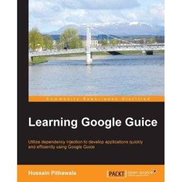
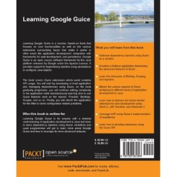

# [Learning Google Guice]
This repository houses the various examples for the book "Learning Google Guice"

Learning Google Guice 3.0 is instant, hands on book to cover various areas of dependency injection using the features provided by latest version of Guice. It focuses on core functionality as well as covers various extensions surrounding Guice making it useful in other areas like web development, integration with frameworks for web development and persistence.

# Table Of Contents

-   Preface

-   Chapter 1: Getting Started with Guice

    -   Wiring dependencies

        -   Resolving dependencies directly

        -   Inverting the dependencies

        -   Understanding Inversion of Control

        -   Inverting the control using the Dependency injection

    -   Comparing two approaches

        -   Initializing dependencies directly

        -   Refactoring to use Guice

    -   Building and Running the examples

        -   Compiling the sample code

        -   Running Unit tests

        -   Running the main application

    -   Summary

-   Chapter 2: Exploring Google Guice

    -   Meet the injector

        -   Various kinds of injections

            -   Field injection

            -   Method injection

            -   Constructor injection

    -   Configuring a module to write bindings

        -   Bindings

            -   Linked bindings

            -   Instance bindings

            -   Untargeted bindings

            -   Constructor bindings

        -   Binding annotations

        -   Binding constants

        -   Binding properties

        -   Just in time bindings

            -   By default constructors

            -   \@Inject annotated constructors

            -   Interfaces annotated with \@ImplementedBy

    -   Static injection

    -   Summary

-   Chapter 3: Diving Deeper in Guice

    -   Going the extra mile with Providers

        -   Need for a Provider

            -   Working of a Provider

        -   Rolling your own Provider

            -   Injecting dependencies in Providers

            -   Advantages of a Provider

            -   \@Provides

        -   CheckedProviders

            -   \@CheckedProvides

    -   AssistedInject

    -   Binding collections

        -   Using TypeLiteral

        -   Using MultiBinder

    -   Scoping

        -   Singletons with Guice

        -   Eager Singletons

        -   Custom Scopes

            -   Motivation to write a custom scope

            -   Modifying our Provider

            -   Defining our own scope

            -   Changes in Module

            -   Observations

    -   Summary

-   Chapter 4: Guice in Web Development

    -   Structure of flightsweb application

    -   Using GuiceFilter

    -   Rolling out our ServletContextListener interface

    -   ServletModule -- the entry point for configurations

    -   Binding language

        -   Mapping servlets

        -   Mapping filters

    -   Web scopes

        -   \@RequestScoped

        -   \@SessionScoped

        -   \@RequestParameters

        -   Exercising caution while scoping

    -   Summary

-   Chapter 5: Integrating Guice with Struts 2

    -   Introducing Struts 2

        -   Guice 3 and Struts 2 integration

            -   Struts2GuicePluginModule

            -   Struts2Factory

        -   FlightSearch application with Struts 2

            -   FlightServletContexListener

            -   Index page

            -   FlightSearchAction

            -   Response page

    -   Summary

-   Chapter 6: Integrating Guice with JPA 2

    -   Introduction to JPA 2 and Hibernate 3

        -   Persistence Unit

        -   PersistenceContext

        -   EntityManagerFactory

        -   EntityManager

        -   Session Strategies

    -   Guice 3 with JPA 2

        -   PersistService

        -   UnitOfWork

        -   JpaPersistService

        -   PersistFilter

        -   \@Transactional

        -   JpaLocalTxnInterceptor

        -   JpaPersistModule

    -   FlightSearch application with JPA 2 and Hibernate 3

        -   Persistence.xml

        -   Client

        -   SearchResponse

        -   FlightEngineModule

        -   FlightJPASupplier

        -   FlightServletContextListener

    -   Summary

-   Chapter 7: Developing Plugins and Extensions using Guice

    -   Developing a plugin

    -   Guice SPI (Service Provider Interface)

        -   Quick introduction to Visitor Design pattern

        -   Elements SPI

            -   Implementing Elements SPI

            -   Uses of Elements SPI

        -   Extensions SPI

    -   Exploring a custom extension, guice-multibinder

        -   Important classes and interfaces in guice-multibinder

        -   Multibinder in action

    -   Summary

-   Chapter 8: AOP with Guice

    -   What is AOP?

    -   How AOP works?

    -   How Guice supports AOP?

        -   Implementing a LoggingInterceptor

        -   Understanding Matchers

        -   Limitations

    -   Concerns related to performance

    -   Summary

-   Appendix: Prerequisites

    -   Getting the sample code

        -   Installing Git

        -   Cloning the repository

    -   JDK

    -   Installing Maven

        -   Mac OSX and Linux

        -   Microsoft Windows

    -   Installing Eclipse

    -   Installing the m2eclipse plugin

    -   Installing Apache Tomcat

    -   Installing MySQL

        -   Microsoft Windows

        -   Mac OSX

        -   Linux

    -   Importing MySQL data

-   Index

# Topic

Wiring dependencies in java application has been formally a topic of
debate among developers and architects. Prior to the advent of DI
frameworks, this has been accomplished mostly using hard coded
dependencies, vanilla injection using constructors or setter APIs or
using abstract factory/factory design pattern. Lack of a standard to
achieve the same has often caused problems to properly design the APIs,
separating logical concerns from infrastructure part.

# Key Features

1.  Learn how to avoid vanilla dependency injection using Guice as a solution.

2.  Set up the stage for a fictitious application development, which would start as a small SA application and conclude as a Struts 2, JPA 2, Hibernate 3 powered web application, all harnessing features of Guice 3.

3.  Learn intricacies of Binding, Scoping and Injection. Master various aspects of Guice pertaining to different areas of application development in Java.

4.  Learn to harness guice-servlet extension for web development using JSP and Servlets.

5.  Learn to harness guice-struts2 extension for web development using struts 2.

6.  Learn to harness guice-persist extension to develop an application using JPA 2, Hibernate 3.

7.  Leverage AOP using Guice implementation of aopalliance.

8.  Learn how to develop extensions using Guice SPI, Service Provider interface.

# Broad Sweep

This book looks forward to dependency injection as an implementation
from Guice. Often developers are confused with myriads of possibilities
offered by Guice. This book offers insight to applying proper solution
to a problem's context. Various Guice extensions are discussed which
avoid complex API usage and keep the spirit of convention over
configuration high.

# Plot

You will start from developing a trivial application by managing
dependencies using Guice 3. As book gradually progresses, we go on
adding the complexity to the application and simultaneously learning
Guice 3.0 features. Various features of Guice like Injector, Provider,
Bindings and Scopes are discussed in detail with recipes for each. Later
we retrofit the application for web bringing Guice to not only manage
dependencies but also to solve configuration related problems. Web
application development using JSP and Servlets is covered which
progresses ahead using Struts 2 with Guice 3. The application later
harnesses Guice 3 to manage dependencies while powering the application
with JPA 2 and Hibernate 3. At last we discuss AOP using Guice and
extend Guice itself using SPI, Service Provider Interface.

# Who this book is for

This book is for anyone having a minimal understanding of application
development in Java and keen to learn dependency injection using Guice.
Architects and Lead programmers, who are into designing structure of the
application would benefit from various recipes to be leveraged during
developing infrastructure pieces. Readers are assumed to have a basic
knowledge of dependency injection, however this is not an obligation.

# Conclusion

*Learning Google Guice 3.0* would help you to harness the various
features of Guice and its extensions in different areas of application
development in Java.
